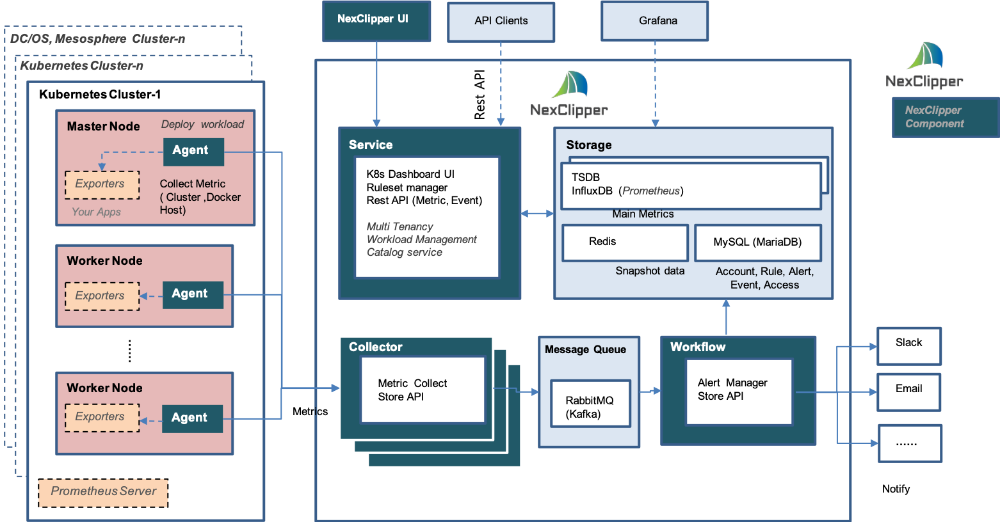
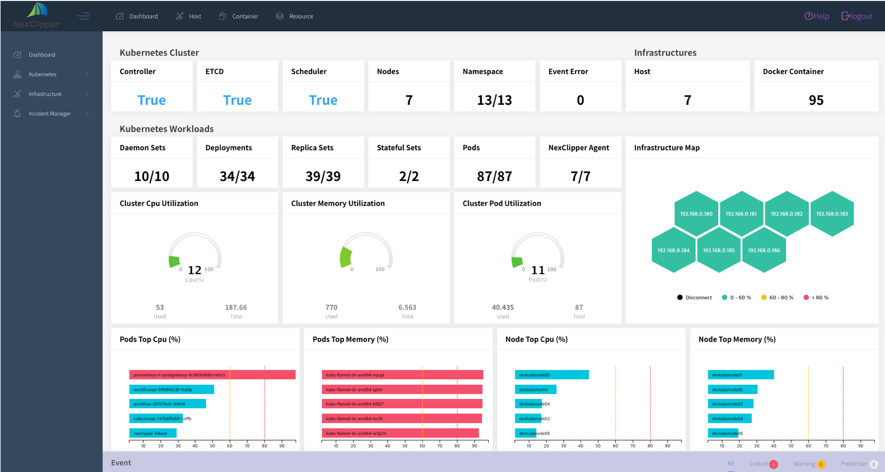

# Monitoring Openshift/Kubernetes with NexClipper

NexClipper is the container and container orchestration monitoring and performance management solution specialized in Docker, Openshift, Kubernetes. NexClipper Cloud especially supports machine learning based predictive, forecasting, anomaly detection.

## Architecture Overview



## NexClipper Dashboard



## Quick Install

NexClipper can be deployed on Openshift/Kubernetes cluster. 

### Prerequisites

- Installed Openshift/Kubernetes Cluster 

### Prepare deployment

#### Step #1 Create project/namespace and do proper patching

```
oc new-project nexclipperagent
oc new-project nexclipper

oc patch namespace nexclipper -p '{"metadata":{"annotations":{"openshift.io/node-selector":"region=infra"}}}'
oc patch namespace nexclipperagent -p '{"metadata":{"annotations":{"openshift.io/node-selector":""}}}'
```

#### Step #2 Setup Redis

```
oc project nexclipper
oc create -f redis/deployment.yaml
oc create -f redis/service.yaml
```

#### Step #3 Setup Mysql

```
oc create -f mysql/mysql-pvc.yaml
oc create -f mysql/deployment.yaml
oc create -f mysql/service.yaml
```

- Create Mysql table and data
```
oc cp mysql/load.sql <mysql pod>:/tmp/
  oc rsh <mysql pod> 
  > mysql -uadmin -ppassword
  > use defaultdb
  > source load.sql
```

#### Step #4 Setup Influxdb

```
oc create -f influx/mysql-pvc.yaml
oc create -f influx/deployment.yaml
oc create -f influx/service.yaml
```

#### Step #5 Setup Rabbitmq

```
oc create -f rabbitmq/deployment.yaml
oc create -f rabbitmq/service.yaml
```

#### Step #5 NexClipper service deployment

> #### workflow

```
oc create -f workflow/deployment.yaml
```

> #### collector

```
oc create -f collector/deployment.yaml
oc create -f collector/service.yaml
```

> #### nexservice

```
oc create -f nexservice/deployment.yaml
oc create -f nexservice/service.yaml
oc expose service/nexclipper-service
```

### NexClipper Agent daemonset/deployment

- Deploy NexClipepr Agent on Kubernetes cluster as follows
  - agent deployed by daemonset: get host and docker container's information
  - agent deployed by deployment: get Kubernetes cluster's information

Agent normally deployed different project/namespace ```nexclipperagent```

```
oc create -f nexclipper-agent/nexclipper-agent.yaml
```


### Now you can access NexClipper web UI
```
oc get route
```

#### Reference

https://github.com/NexClipper/NexClipper

#### Live Demo

https://demo.nexclipper.io/
